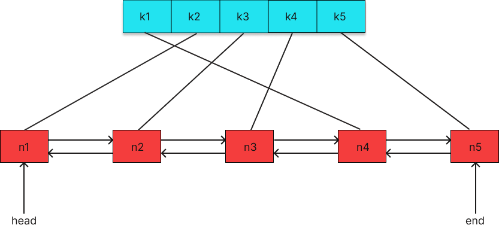

## Instruction

#### 1.Something about distribute cache.

Not every request data comes from database, but cache which store in local, CDN server or redis. And the most easy cache storement is `dict`, which same as `map` in Golang. But if you directly use them there may be some problems need to be thinking:

- Memory release strategy

  Memory is not infinitly, that means we need a strategy to detele some old data. There are much drifference between delete randomly and delete by time.  And deleted by data access frequency seems better. So a reasonable release strategy need to construct.

- Concurrent conflicts

  Access to cache data can't be serial but concurrent, and there is no a protection on map. So we need a lock them when try to CRUD.

- Single mechine not enough

  Single mechine has constration in compution and storement. When the development, there always are some bottleneck. So a distribute computer system can provide scale horizontally (scale vertically). Under most situation, distribute system is a much better choise.

#### 2.Something about this project -- CacheStorm

`groupcache` is the memcached but in Go, aims to replace them in some specific situation. And CacheStrom is a tiny version of groupcache but still keep the most important features, as follows:

- Single mechine cache and distribute cache based on HTTP.
- Least Recent Used(LRU) cache strategy.
- Use lock in Go mechanism to avoid cache burst.
- Use consistent hashing to select nodes and achieve load balancing.
- Use protobuf to enhance the connect between in nodes.

#### 3.Start

##### 3.1 Implement LRU

After we inserted a record, the memory size is over the origin set N. So we need to remove a data which is most unuseful. But how decision the "useful"? 

Before to instruct last recent used strategy, these are three cache realse strategy you need to know.

###### FIFO / LFU / LRU

- FIFO(First in fisrt out)

  First record in memory will be firstly delete if memory is not enough. But in some situation, the fist in data always be the most access data, so if use this, the hit precent in cache will decrease.

- LFU(Least frequently used)

  Least frequently used means realse the least frequently accessed records in the cache. But we need a count record about each, that will cost memory. And in sometimes, a data because the historical count record is too high so can't realse in a period.

- LRU(Least recent used)

  Compare to the FIFO focus on time and LFU fucus on frequently, least recent used construct a balance in them. And it core idea is the most recent accessed data will be also most accessed in future.

###### LRU

the data struct as follows:



So, its clear that there are two core:

- The bule one is a map that store a preject related pair (k,v). 

- The red one is a double linked list that store the entry. Use such data struct can easy access to a value and the complexity is `O(1)`

##### 3.2 Single mechine concurrent cache

Conflict will occurred when some goroutine try to read/write same one variant. Make sure that only one goroutine can access a variant in one time, commonly called it as `mutex` (sync.Mutex comes form Go standard library).

###### Support for R/W in concurrent

Actually, we need a new struct to encaps the `LRU` , like as follows:

```go
type cache struct {
  mu          sync.Mutex
  lru        *lru.Cache
  cacheBytes  int64
}
```

By the way, cache will also have `add` and `get`, which is safe in concurrent because the use sync.Mutex lock/unlock. But it will call lru's `add` and `get`.

###### Main struct -- Group

The Group is the most important data struct , which aim to contact with users and control the store and the process of  cache value. It's descripted as:


or

```bash
                                 Yes
Receive key --> Check if cached -----> Return cached value ⑴
                  |  Yes                          Yes
                  |-----> fetch from remote node -----> remote node --> Return cached value ⑵
                            |  No
                            |-----> Call `callback` --> Return cached value ⑶
```

So it clear that the Group's main code struct is：

```bash
CacheStorm/
	|--lru/
			|--lru.go    // lru realse startegy
	|--byteview.go   // abstract cache value 
	|--cache.go      // control concurrent
	|--cachestorm    // contact with users

```

###### Callback Getter

Actually we could not try to implement all method that try read from drifferent data source, but can provide a function to user that implement to read data in personal scenario. And if the cache is not exists, call this function could get data.

###### Definition of Group

```go
type Group struct {
	name      string
	getter    Getter
	mainCache cache
}
```

So the attribute `name` in Group can be regard as a cache namespace, and every Group has a own unique name. `getter` is the callback that hit cache failed. And the `mainCache` is the safe cache under concurrent which has implemented before.

###### The Get method in Group

The core in `Get` is the implement the logic in the picture, and most important is first find in cache if does't exits, the data will load from `Getter` which in the most situation is database or file.

##### 3.3 Build HTTP server

There must be communicate if we needed between in nodes, a mechinsm based on http is the most easy and common way. If a node start its http service, so it can be accessed by other node.

The request URL can be http://localhost:<port>/basepath/groupname/key

> Basepath can avoid to comfict to other http service.

In this part, we need to get the groupname and key in the URL. And get the key from the Group which describe in before. And this logic is implemented in the `ServeHTTP(http.ResponseWrite,*http.Request)`.

##### 3.4 Consistent Hashing

###### Why we need consistent hashing in StormCache?

- Which node should be accessed?

When a distribute cache system got a data request, which the node should be accessed. We could assume that node 1 be selected, if there is no data, so we get it by other source. And if the key come to again, there is a proability to other node, and the process will be execute again and data store in two node that will cause memory loss.

Acctually there is way to solve this problem that we use `Hash(key) % 10` and the result will decide the data to which node. And if any node hava data requst will assign the task to this node.


- What if the node's number will change?

We could use `Hash(key) % count(nodes)` to solve the data cache performance problem, but did't put the node's number changes in our design. Because if we delete a node in this system, the result out by `Hash(key) % count(nodes)` will change naturally and that's not what we want to see (If all caches to node has beem changes, mostly we called it as `Cache Avalanche`).

> Cache avalanche: All cache disavliable at the same time and cause many request to database which got a lot request pressure to avalanche. Mostly it cause by cache's server down upexpectly or cache has same expire time.

All of this problem will be changed by consistent hashing.

###### Algorithm Principle(Consistent Hashing)

consistent hashing will project the key to 2^32, and connect the head and tail make a circle. Steps as follows:

- caculate the node's(node's name, id and ip) hashing value and put it on a circle.
- caculate the key's hashing value, put it on circle and found the first node clockwise which be regarded as selected. 


So Key1、Key2 will on Peer1 and Key3 on the Peer2 and Key4 on Peer3 , and if the Peer3 was removed, so Key4 will be put on Peer1 natrually. `That means we only change the cache which put on this changed node, most cache still keep before.`

But we need care about another issue that is data skew expecially in merely node. Like before example, most data will put on node2 and not build enough banance in different node. To fix this, a new concept virtul node was introduce. This means a real node project to many virtual node(one-to-many). For example, peer1 has peer1-1、pe er1-2 and peer1-3(mostly like assign the new ids), and caculate them hash to put the on the circle. It usefully change the node distribute and avoid the data to store in most one or two node but cost nothing only a map which contain this one-to-many relationships.

##### 3.5 Distribute Node

Based on part 3.4, a new logic should be:

```bash
consistenthash?           YES                              Yes
    |-----> remote node? -----> HTTP client --> success？-----> server return value
                    |  No                                             ↓  No
                    |-----------------------------------------> callback to local note
```

##### 3.6 Single Flight

###### Basic Concept

- Cache Avalanche(缓存雪崩)

The database get a lot request and the pressure is over to cause avalanche which caused by all cache disavliable at one time. Avalanche commonly is caused by cache server unreasonly shutdown or the key in cache was set same expire time.

- Cache breakdown(缓存击穿)

A lot of request access to database when a key expired and the volume is over the databased which can process.

- Cache penetration(缓存穿透)

Many query request but does't have this data, that's mean no key in cache and every request will access to database. 

> Avalanche:Invalid
>
> Breakdown:Expired
>
> Penetration:Not Existed

###### Implement of Singleflight

We hava built these distribute system, but there is still some problem like if we request from port1 to port2 N times, and if there is no cache so every request will request database which can't expect by us. And singleflight was designed to always request to remote node only one time.

##### 3.7 Protobuf

###### Why use protobuf?

Protobuf (Protocol buffers) a data descript language development by google, and it has sample but efficient structural data store format not related to code language or code plateform.

###### Use Protobuf in CacheStorm

- build a `.pb` file 

```protobuf
syntax = "proto3";

package cachepb;
option go_package=".";

message Request {
  string group = 1;
  string key = 2;
}

message Response {
  bytes value = 1;
}

service GroupCache {
  rpc Get(Request) returns (Response);
}
```

And we also change Get interface in `peers`  and to implement these interface created by protobuf.

#### 4. Summary

All of the project struct as follows:

```bash
(base) zhaodeng@zhaodeMacBook-Pro CacheStorm % tree
.
├── README.md
├── cache
│   ├── byteview.go
│   ├── cache.go
│   ├── cachestorm.go
│   ├── cachestorm_test.go
│   ├── consistenthash
│   │   ├── consistenthash.go
│   │   └── consistenthash_test.go
│   ├── http.go
│   ├── lru
│   │   ├── lru.go
│   │   └── lru_test.go
│   └── peers.go
├── cachepb
│   ├── cache.pb.go
│   └── cache.proto
├── go.mod
├── go.sum
├── main.go
├── run.sh
├── server
└── singleflight
    └── singleflight.go

6 directories, 19 files
```

